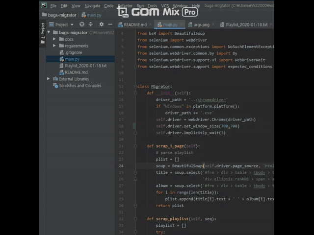

# Nomad Player

A simple playlist migration app supporting the following sites.

| from | to |
|---|---|
| Melon  | Bugs |
| Bugs | Youtube Music |

## Screenshot



## Release Note (Ver 2.1)
- support Youtube Music

## Prerequisites
This application will proceed in the following environment (Recommended).
- Python 3.7
- Chrome Driver [83.0.4103.39](https://chromedriver.storage.googleapis.com/index.html?path=83.0.4103.39/)

Before running the app, the `chrome browser` and `chrome driver` with same version is needed. Check the version of chrome browser with following command.
```bash
google-chrome --version
```

## Installation
Following commands run on Ubuntu 18.04. There are some variations on Windows.
```bash
$ git clone https://github.com/cupjoo/nomad-player.git
$ virtualenv venv && . venv/bin/activate
$ cd nomad-player
$ pip install -r requirements/requirement.txt
```

## How to run app
- Before run the app, fill the arguments with your bugs account and serial number of playlist.


- Run 'main.py' with python3.
```bash
$ python main.py
```
- Then, the songs are added to at the top of the playlist you created in Bugs.

## Caution
Too many attempts to run the app in a short period of time can result in restricted access from the melon (maybe for about 10~20 minutes).

## Issues

[Automatically Google Login by Selenium](https://gist.github.com/ikegami-yukino/51b247080976cb41fe93#gistcomment-3181443)
